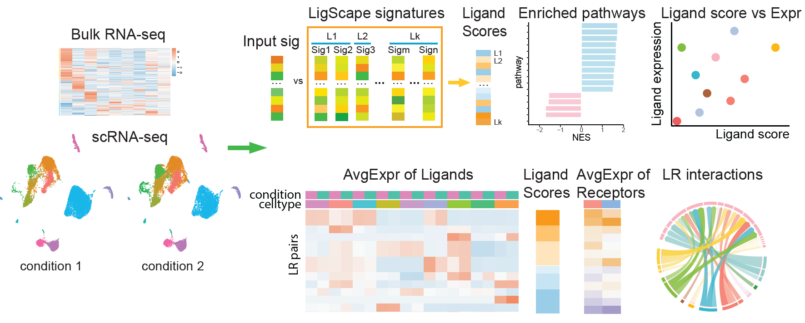

# LigScape

<!-- badges: start -->
<!-- badges: end -->

LigScape is a full-featured R package for analyzing cell-cell communication from bulk & single-cell RNA-seq data

<hr>

**LigScape: A Comprehensive Database of Ligand Signatures to predict cell-cell communication** <br />
Ligand-receptor interactions mediate intercellular communication, inducing transcriptional changes that regulate physiological and pathological processes. Ligand-induced transcriptomic signatures can be used to predict active ligands; however, the absence of a comprehensive set of ligand-response signatures has limited their practical application in predicting ligand-receptor interactions. To bridge this gap, we developed LigScape, a curated [database](https://github.com/yingxinac/LigScapeData/) encompassing intracellular transcriptomic signatures for human ligands. LigScape compiles signatures from published transcriptomic datasets and established resources, generating both gene- and pathway-based signatures for each ligand. <br />
Using the LigScape database as a reference, we developed a companion computational tool LigScape that infers the ligands responsible for transcriptomic changes within receiver cells, and the corresponding cell-cell interaction networks between multiple cell types or clusters.

<hr>

<div  align="center">

</div>

<hr>


### Installation

**Install devtools**
``` r
if (!requireNamespace("devtools", quietly = TRUE)) install.packages("devtools")
```

**Install dependencies**
``` r
install.packages(c("tidyverse", "Seurat", "RColorBrewer", "pheatmap", "lsa", "data.table", "circlize", "randomcoloR", "hrbrthemes", "ggrepel"))
bio_pkgs = c("fgsea", "graphite")
if (!require("BiocManager", quietly = TRUE))
  install.packages("BiocManager")
BiocManager::install(bio_pkgs)
library(devtools)
devtools::install_github("cdesterke/geneconverter")
```

**Install LigScape**
``` r
devtools::install_github("yingxinac/LigScape")
```

<hr>

### Database
LigScape database is available at
[LigScapeData](https://github.com/yingxinac/LigScapeData/)

<hr>

### Using LigScape
[Example: Perform LigScape analysis](vignettes/LigScape.md)


