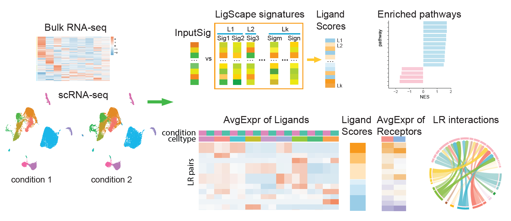

# LigScape

<!-- badges: start -->
<!-- badges: end -->

LigScape is a full-featured R package for analyzing cell-cell communication from bulk & single-cell RNA-seq data

<hr>

<div  align="center">

</div>

<hr>

### Installation

**Install devtools**
``` r
if (!requireNamespace("devtools", quietly = TRUE)) install.packages("devtools")
```

**Install dependencies**
``` r
install.packages(c("tidyverse", "Seurat", "RColorBrewer", "pheatmap", "lsa", "data.table", "circlize"))
bio_pkgs = c("fgsea", "graphite")
if (!require("BiocManager", quietly = TRUE))
  install.packages("BiocManager")
BiocManager::install(bio_pkgs)
library(devtools)
devtools::install_github("cdesterke/geneconverter")
```

**Install LigScape**
``` r
devtools::install_github("yingxinac/LigScape")
```

<hr>

### Using LigScape
[Example: Perform LigScape analysis](vignettes/LigScape.html)


